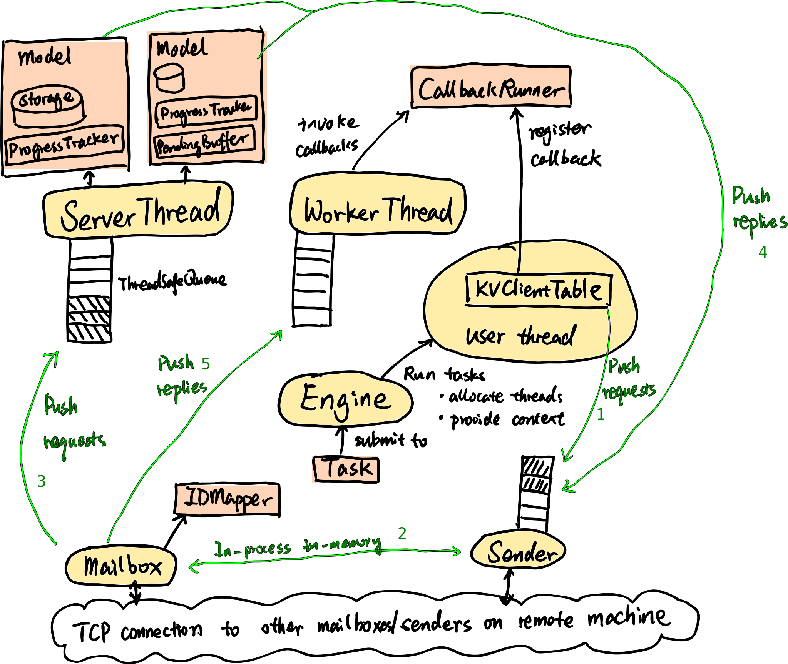

# CSCI5570 Parameter Server Project Demonstration

In courtesy of the Husky team. Special thanks to Yuzhen Huang.

## Install & Run
Git clone this repository by
```sh
git clone https://github.com/TatianaJin/csci5570.git
cd csci5570
```
Create a directory for putting compiled files, and configure cmake.
```
mkdir build && cd build
cmake .. -DCMAKE_BUILD_TYPE=Debug
```
See the make list by `make help`, and make anything in the list by `make ${ANYTHING}`

```
cd build/     # cd to the build directory
make -j4      # build all the targets
./HuskyUnitTest  # run all unit tests
./HuskyUnitTest --gtest_filter=TestServerThread.RegisterModel  # run a specific test
```


## Tutorial 2
* The mailbox is provided as a bottom layer communication module
* The prototypes of server threads, worker threads, and communication threads are also provided for your reference
* There are some utility files for compilation and testing for your reference

## Tutorial 3
* Check the overall picture about the worker and server in test/test\_worker.cpp and test/test\_server.cpp.
* Understand how the modules on the server side work together.
* Implement server\_thread.cpp according to the information given in server\_thread\_test.cpp.
* Implement map\_storage.hpp according to the information given in map\_storage\_test.cpp.

## Tutorial 4
* Check base/abstract_partition_manager.hpp and implement your parititoning strategies
* You should have tried implementing MapStorage last week. You may try other storage method such as vector.
* Write a small program to link the paritition manager with the storages and to initialize storages associated with different server threads

## Tutorial 5
* Check worker/kv\_client\_table\_test.cpp. Understand how `AbstractCallbackRunner` and `AbstractPartitionManager` functions and how the modules on the worker side work together
* Understand how model parameters are rendered to users in the process from mailbox receiving messages, to worker threads invoking callbacks, and finally to KVClientTable returning with completed requests
* Implement a callback runner to handle reply messages
* Implement [KVClientTable](worker/kv_client_table.hpp) according to the information given in worker/kv\_client\_table\_test.cpp

## Tutorial 6
* Check the io folder and understand how to connect to HDFS and coordinate data loading among workers
* Take a look at test/test_hdfs_read.cpp and see how the connector may be used to load data
* Check the lib folder for the abstraction of data loaders and labeled sample
* Implement the data loaders and parsers. Understanding the producer-consumer paradigm may help

## Tutorial 7
* Check the tests for the three consistency models and understand the expected behaviors
* Check the pending buffer and progress tracker interface
* Implement ASP, BSP, and SSP models

## Tutorial 8
* Check the tests and complete engine.cpp, info.hpp, simple_id_mapper.cpp, and worker_spec.cpp
* Write a script to launch the system on the cluster

### Some tools: 
* [glog](http://rpg.ifi.uzh.ch/docs/glog.html). You may use `GLOG_logtostderr=1 ./HuskyUnitTest` to print the `LOG(INFO)` information to the console.
* [gtest](https://github.com/google/googletest/blob/master/googletest/docs/Primer.md).
* Actor model
* cmake
* C++ (C++11, multi-threading, std::move, rvalue reference, classes...)
